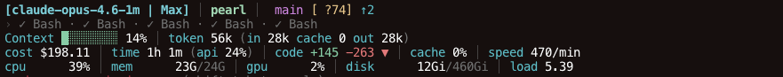
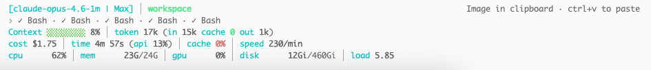

# claude-statusline-hud

A comprehensive, btop-inspired statusline HUD plugin for Claude Code. Cross-platform (macOS + Linux) with adaptive terminal width.

> Forked from [Thewhey-Brian/claude-statusline-hud](https://github.com/Thewhey-Brian/claude-statusline-hud) with customizations: removed Usage rate limit row, moved token stats to Context row, added key labels for clarity.


## Preview

### Dark Terminal


### Light Terminal


## Presets

| Preset | Rows | What you see |
|---|---|---|
| `minimal` | 1 | Model, directory, git branch & status |
| `essential` | 2–3 | + Activity (when active), context bar with token stats |
| `full` | 3–5 | + Session stats (cost, time, code, cache, speed), token breakdown at 85%+ |
| **`vitals`** | **4–6** | **+ System vitals (CPU, memory, GPU, disk, battery, load) (default)** |

### Switch preset

```bash
# Option 1: Write to file
echo "vitals" > ~/.claude/statusline-preset

# Option 2: Environment variable
export CLAUDE_STATUSLINE_PRESET=essential

# Option 3: Use the built-in skill
/statusline
```

## Presets × Terminal Width

<details>
<summary><b>minimal</b> — 1 row</summary>

**Wide (≥100 cols):**
```
[Opus 4.6 (1M context) | Max] │ my-project │  main ✓ ↑2 │ ⚡ agent
```

**Normal (70–99 cols):**
```
[Opus 4.6 | Max] │ my-project │  main ✓
```

**Compact (<70 cols):**
```
[Opus | Max] │ my-project │  main ✓
```
</details>

<details>
<summary><b>essential</b> — 2–3 rows</summary>

**Wide (≥100 cols):**
```
[Opus 4.6 (1M context) | Max] │ my-project │  main [+2 ~1] ↑2
› ◐ Edit auth.ts · ✓ Read ×3 │ ▸ Fix auth bug (2/5)
Context ██████████ 42% │ token 44k (in 41k cache 0 out 2k)
```

Activity row only shows when tools/todos/agents are active — otherwise 2 rows.

**Compact (<70 cols):**
```
[Opus | Max] │ my-project │  main ✓
Context ██████ 42% │ token 44k (in 41k cache 0 out 2k)
```
</details>

<details open>
<summary><b>full</b> — 3–5 rows (default)</summary>

**Wide (≥100 cols):**
```
[Opus 4.6 (1M context) | Max] │ my-project │  main ✓ ↑2 │ ⚡ agent
› ◐ Edit auth.ts · ✓ Read ×3 │ ▸ Fix auth bug (2/5) │ ⚡ explore
Context ██████████ 42% │ token 44k (in 41k cache 0 out 2k)
cost $1.31 │ time 12m 3s (api 68%) │ code +142 -38 ▲ │ cache 87% │ speed 1k/min
```

**At high context (85%+), a token breakdown row appears:**
```
Context █████████░ 87% ⚠ │ token 179k (in 30k cache 140k out 4k)
  tokens 179k/200k — in 30k cached 140k created 5k out 4k
```

**Activity row only shows when tools/todos/agents are active — otherwise hidden.**

**Compact (<70 cols):**
```
[Opus | Max] │ my-project │  main ✓
Context ██████ 42% │ token 44k (in 41k cache 0 out 2k)
cost $1.31 │ time 12m 3s │ code +142 -38 ▲
```
</details>

<details>
<summary><b>vitals</b> — 4–6 rows</summary>

**Wide (≥100 cols):**
```
[Opus 4.6 (1M context) | Max] │ my-project │  main ✓ ↑2 │ ⚡ agent
› ◐ Edit auth.ts · ✓ Read ×3 │ ▸ Fix auth bug (2/5)
Context ██████████ 42% │ token 44k (in 41k cache 0 out 2k)
cost $1.31 │ time 12m 3s (api 68%) │ code +142 -38 ▲ │ cache 87% │ speed 1k/min
cpu ██▌  35% │ mem ███▊ 15G/16G │ gpu █    11% │ disk ▋   15G/926G │ bat ████ 80% │ load 2.41
```

**Compact (<70 cols):**
```
[Opus | Max] │ my-project │  main ✓
Context ██████ 42% │ token 44k (in 41k cache 0 out 2k)
cost $1.31 │ time 12m 3s │ code +142 -38 ▲
cpu ██▌  35% │ mem ███▊ 15G/16G │ gpu █    11%
```
</details>

## Install

### Quick Install

```bash
# Step 1: Add the marketplace
/plugin marketplace add MashellHan/claude-statusline-hud

# Step 2: Install the plugin
/plugin install claude-statusline-hud
```

The plugin auto-configures on the next session start via a `SessionStart` hook. If the statusline doesn't appear, run the setup script manually:

```bash
bash ~/.claude/plugins/cache/claude-statusline-hud/claude-statusline-hud/*/scripts/setup.sh
```

### Uninstall

```bash
# Step 1: Remove statusLine config
bash ~/.claude/plugins/cache/claude-statusline-hud/claude-statusline-hud/*/scripts/teardown.sh

# Step 2: Remove the plugin
/plugin uninstall claude-statusline-hud
```

### Alternative: Test Locally

```bash
claude --plugin-dir /path/to/claude-statusline-hud/plugins/claude-statusline-hud
```

## What Each Metric Means

### Row 1 — Identity & Location
| Element | Description |
|---|---|
| `[Model \| Max]` | Active model name and subscription plan |
| `Dir` | Current working directory (`~` for home) |
| ` branch` | Git branch with dirty status (`+staged ~unstaged ?untracked`) |
| `↑↓` | Commits ahead of / behind remote |
| `⚡ agent` | Active agent name (when using `--agent`) |
| `🌿 worktree` | Active worktree name and branch |
| `NORMAL`/`INSERT` | Vim keybinding mode |

### Row 2 — Live Activity (conditional, only when active)

Shows the last 5 tools (most recent first), parsed from the session transcript. Only appears when there's activity.

**Example:**
```
› ◐ Edit auth.ts · ✓ Read · ✓ Bash · ✓ Grep │ ▸ Fix auth (2/5) │ ⚡ explore
```

| Symbol | Meaning |
|---|---|
| `›` | Activity row prefix |
| `◐` | Tool currently running — shows first 25 chars of target |
| `✓` | Tool completed |
| `▸` | Active todo/task in progress |
| `⚡` | Running subagent |

### Row 3 — Context & Tokens
| Element | Description |
|---|---|
| `Context 42%` | Context window fill % with autocompact buffer estimation |
| `⚠` | Warning when adjusted context ≥ 90% or tokens exceed 200k |
| `token 110k` | Total tokens consumed this session (input + output) |
| `in 98k` | Input tokens |
| `cache 0` | Cached (read) tokens — higher means cheaper |
| `out 12k` | Output tokens generated |
| `tokens 179k/200k — ...` | Detailed breakdown row at 85%+ context |

### Row 4 — Session Stats
| Element | Description |
|---|---|
| `cost $71.92` | Total API cost this session (USD) |
| `time 14m 44s` | Wall-clock session time |
| `(api 40%)` | % of time spent waiting for API responses |
| `code +13 −127 ▼` | Lines added/removed with net direction (▲ growing, ▼ shrinking, ═ neutral) |
| `cache 0%` | Prompt cache hit rate — higher means cheaper and faster |
| `speed 832/min` | Output token throughput (tokens per minute) |

### Row 5 — System Vitals (btop-style)
| Element | Description |
|---|---|
| `cpu` | User + system CPU usage with sub-character precision bar |
| `mem` | Memory used / total |
| `gpu` | GPU utilization (Apple Silicon, NVIDIA, or AMD/Intel) |
| `disk` | Root volume used / total |
| `bat` | Battery level (red alert ≤20%) |
| `load` | 1-minute load average |

## Adaptive Width

The statusline automatically adapts to your terminal width:

| Width | Model label | Bar width | Vitals |
|---|---|---|---|
| **Wide** (≥100) | `Opus 4.6 (1M context)` | 10 chars | All (cpu/mem/gpu/disk/bat/load) |
| **Normal** (70–99) | `Opus 4.6` | 8 chars | All |
| **Compact** (<70) | `Opus` | 6 chars | cpu/mem/gpu only |

## Platform Support

| Feature | macOS | Linux |
|---|---|---|
| CPU usage | `/usr/bin/top` | `/proc/stat` delta |
| Memory | `/usr/bin/top` + `sysctl hw.memsize` | `/proc/meminfo` |
| GPU | `ioreg` (Apple Silicon) | `nvidia-smi` or `/sys/class/drm` |
| Disk | `df` | `df` |
| Battery | `pmset` | `/sys/class/power_supply/BAT0` |
| Load average | `sysctl vm.loadavg` | `/proc/loadavg` |

## Performance

All expensive operations are cached to keep the statusline snappy:

| Data source | Cache TTL | Notes |
|---|---|---|
| Live activity (tools/todos/agents) | 2 seconds | Parses last 80 lines of transcript JSONL |
| System vitals (CPU/mem/GPU/disk) | 5 seconds | Single cache file, sourced as shell vars |
| Git info (branch, dirty, ahead/behind) | 10 seconds | |

## Environment Variables

| Variable | Description |
|---|---|
| `CLAUDE_STATUSLINE_PRESET` | Override preset file (`minimal`/`essential`/`full`/`vitals`) |
| `CLAUDE_SL_ASCII=1` | Force ASCII bars (`#` `-` instead of `█` `░`) |
| `CLAUDE_SL_UNICODE=1` | Force Unicode bars |

## Requirements

- **Required:** `bash`, `jq`
- **Optional:** `git` (git status)

## File Structure

```
claude-statusline-hud/
├── .claude-plugin/
│   └── marketplace.json       # Marketplace catalog
├── plugins/
│   └── claude-statusline-hud/
│       ├── .claude-plugin/
│       │   └── plugin.json    # Plugin manifest
│       ├── hooks/
│       │   └── hooks.json     # SessionStart hook for auto-setup
│       ├── scripts/
│       │   ├── statusline.sh  # Main statusline script
│       │   ├── setup.sh       # Post-install: injects statusLine config
│       │   └── teardown.sh    # Post-uninstall: removes statusLine config
│       └── skills/
│           └── statusline/
│               └── SKILL.md   # /statusline skill for preset switching
├── LICENSE
└── README.md
```

## License

MIT
